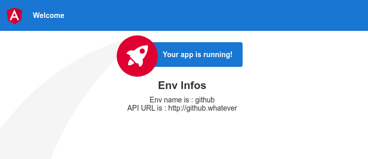

# Angular : CI / CD with one build 

How to manage multiple deployments with the same Build

## Example 

App deployed on Github pages with custom env : `envName` and `apiUrl` 




## Installation

```shell
npm install
```

### Usage

Serve  

```shell
npm run start
```

Test 

```shell
npm run test
```


Build 

```shell
npm run build
```

## Deploy


Use `gh-pages` node module to deploy to github pages


```shell
npm run deploy:gh
```

To customize application `name` and `api URL`, we replaced `/dist/env.js` by `/deploy/github.env.js`


